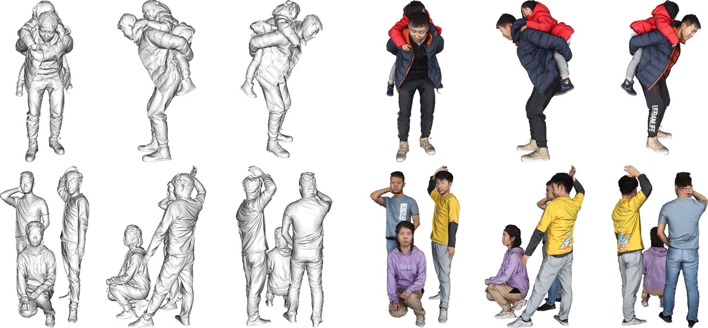
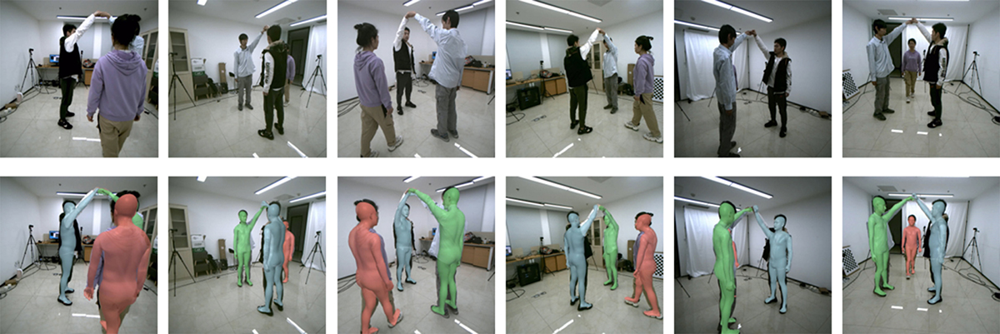

# MultiHuman-Dataset
### DeepMultiCap: Performance Capture of Multiple Characters Using Sparse Multiview Cameras
Yang Zheng*, Ruizhi Shao*, Yuxiang Zhang, Tao Yu, Zerong Zheng, Qionghai Dai, Yebin Liu. ICCV 2021

[[Project Page]](http://www.liuyebin.com/dmc/dmc.html)

### News
* **[2021/9/26]** We release **453 high-quality 3D human scans** with raw obj mesh files (without normalization) and texture maps. Each scan contains 1-3 persons. The dataset can be used to train and evaluate multi-person reconstruction algorithms.
* **[2021/9/18]** We release **MultiHuman dataset** with 150 scans for evaluation purpose and **MultiHuman Real-Cap dataset** with 4 real world multi-view sequences with estimated SMPLX models.

MultiHuman dataset:



MultiHuman Real-Cap dataset:



### Dataset Structure
**MultiHuman dataset** consists of 150 human scans captured by a dense DLSR rig, which is used to evaluate multi-person reconstruction algorithms. We divide the dataset into different categories by the level of occlusions and number of persons including:
* 30 single human scenes
* 18 occluded single human scenes (by different objects)
* 46 natural interactive two-person scenes
* 30 closely interactive two-person scenes
* 26 scenes with three persons. 

For each scene, we provide the normalized 3D model (obj_all/\*\*\*), the cropped single person 3D models (obj/\*\*\*), and the estimated SMPLX models (smplx/\*\*\*). The SMPLX models are fitted from 6 views, which can be used as baselines or ground truth.

Moreover, we release the 453 raw scans providing original meshes (without normalization) and photorealistic texture maps. Note that the data include the raw scans of the above-mentioned 150 scans. These data provide enough capacity to train and evaluate multi-person reconstruction algorithms.

**MultiHuman Real-Cap dataset** contains real world multi-view sequences with estimated SMPLX models. We provide the raw images, calibrations, cropped images (human-centered) with the corresponding camera intrinsic and extrinsic parameters, and SMPLX models.

### Agreement
1. The MultiHuman dataset (the "Dataset") is available for **non-commercial** research purposes only. Any other use, in particular any use for commercial purposes, is prohibited. This includes, without limitation, incorporation in a commercial product, use in a commercial service, as training data for a commercial product, for commercial ergonomic analysis (e.g. product design, architectural design, etc.), or production of other artifacts for commercial purposes including, for example, web services, movies, television programs, mobile applications, or video games. The dataset may not be used for pornographic purposes or to generate pornographic material whether commercial or not. The Dataset may not be reproduced, modified and/or made available in any form to any third party without Tsinghua University’s prior written permission.

2. You agree **not to** reproduce, modified, duplicate, copy, sell, trade, resell or exploit any portion of the images and any portion of derived data in any form to any third party without Tsinghua University’s prior written permission

3. You agree **not to** further copy, publish or distribute any portion of the Dataset. Except, for internal use at a single site within the same organization it is allowed to make copies of the dataset.

4. Tsinghua University reserves the right to terminate your access to the Dataset at any time.

### Download Instructions 
The dataset is encrypted to prevent unauthorized access.

Please fill the [request form](./assets/MultiHuman_Aggrement.pdf) and send it to Yebin Liu (liuyebin@mail.tsinghua.edu.cn) and cc Ruizhi Shao (shaorz20@mails.tsinghua.edu.cn), Yang Zheng (y-zheng18@mails.tsinghua.edu.cn) to request the download link. 

By requesting for the link, you acknowledge that you have read the agreement, understand it, and agree to be bound by them. If you do not agree with these terms and conditions, you must not download and/or use the Dataset.

### Citation
If you use this dataset for your research, please consider citing:
```
@inproceedings{zheng2021deepmulticap,
title={DeepMultiCap: Performance Capture of Multiple Characters Using Sparse Multiview Cameras},
author={Zheng, Yang and Shao, Ruizhi and Zhang, Yuxiang and Yu, Tao and Zheng, Zerong and Dai, Qionghai and Liu, Yebin},
booktitle={IEEE Conference on Computer Vision (ICCV 2021)},
year={2021},
}
```

### Contact
- Yang Zheng [(y-zheng18@mails.tsinghua.edu.cn)](mailto:y-zheng18@mails.tsinghua.edu.cn)
- Ruizhi Shao [(shaorz20@mails.tsinghua.edu.cn)](mailto:shaorz20@mails.tsinghua.edu.cn)
- Yebin Liu [(liuyebin@mail.tsinghua.edu.cn)](mailto:liuyebin@mail.tsinghua.edu.cn)